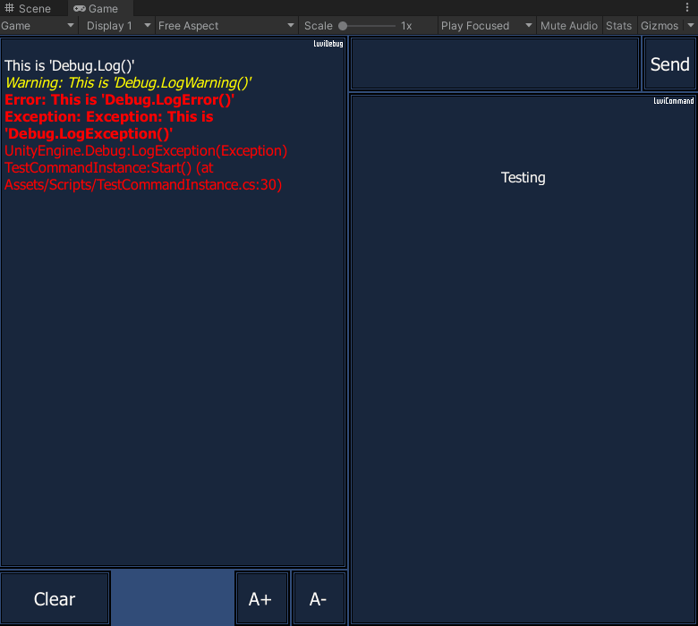
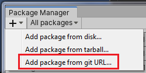

# LuviConsole
LuviConsole is a console IMGUI of Unity that able to show every log that perform in Unity Debug. include custom command feature. This command are support for displaying in mobile platform (Android & iOS) and WebGL (WASM) platform. Created by Thanut Panichyotai (@[LuviKunG]((https://github.com/LuviKunG)))



## How to use?

There are two different way to use.

1. Simply define the `LuviConsole.Instance` in the code where the game is awaking or starting.

```csharp
// Required namespace.
using LuviKunG.Console;

void Awake()
{
    _ = LuviConsole.Instance;
}
```

2. Put the prefab of **LuviConsole** into the most first scene. You can find it in package folder from this path: **Packages/LuviConsole/Resources/LuviKunG/LuviConsole.prefab**

## How to create command?

Create a new component class and attach this class into the **LuviConsole** GameObject.
Inside the component class, you can add your new command by using these functions.

```csharp
using UnityEngine;
// Required namespace.
using LuviKunG.Console;

public class TestCommandInstance : MonoBehaviour
{
    private void Awake()
    {
        // Create or get instance of LuviConsole.
        LuviConsole console = LuviConsole.Instance;

        // Add a new command of '/foo' that will result debug log of 'bar!'
        console.AddCommand("/foo", (args) =>
        {
            Debug.Log("bar!");
        });

        // Add a new command of '/test' that require arguments and will log all available arguments.
        console.AddCommand("/test", (args) =>
        {
            for (int i = 0; i < args.Count; ++i)
                Debug.Log($"args[{i}] = " + args[i]);
        });

        // Add a new command preset of '/foo' that will be show as button below of command input in the group of 'Testing'.
        console.AddCommandPreset("/foo", "Foo", "Just test command of foo", "Testing", false);

        // Add a new command preset of '/test' that will be show as button below of command input in the group of 'Testing' and will execute immediately when pressed.
        console.AddCommandPreset("/test \"Hello World!\"", "Test", "Just test command of test", "Testing", true);

        // This is custom log for putting message in console directly without receive debug log.
        console.Log("This is custom log");
        console.Log("This is custom log with color", Color.blue);
        console.Log("This is custom log with bold", true, false);
        console.Log("This is custom log with italic", false, true);
        console.Log("This is custom log with both of bold and italic", true, true);
        console.Log("This is custom log with color and bold", Color.blue, true, false);
        console.Log("This is custom log with color and italic", Color.blue, false, true);
        console.Log("This is custom log with color and both of bold and italic", Color.blue, true, true);

        // Execute the command by command string (in runtime).
        console.ExecuteCommand("/foo");
        console.ExecuteCommand("/test Arg1 Arg2 Arg3 Arg4 Arg5");
    }
}
```

## Changelog

Please checkout the [changelog](CHANGELOG.md) if you want to see the older version package.

## How to install?

### UPM Install via manifest.json

Locate to your Unity Project. In *Packages* folder, you will see a file named **manifest.json**. Open it with your text editor (such as Notepad++ or Visual Studio Code or Legacy Notepad)

Then merge this json format below.

(Do not just copy & paste the whole json! If you are not capable to merge json, please using online JSON merge tools like [this](https://tools.knowledgewalls.com/onlinejsonmerger))

```json
{
  "dependencies": {
    "com.luvikung.luviconsole": "https://github.com/LuviKunG/LuviConsole.git#2.7.2"
  }
}
```

If you want to install the older version, please take a look at release tag in this git, then change the path after **#** to the version tag that you want.

### Unity 2019.3 Git URL

In Unity 2019.3 or greater, Package Manager is include the new feature that able to install the package via Git.



Just simply using this git URL and following with version like this example.

**https://github.com/LuviKunG/LuviConsole.git#2.7.2**

Make sure that you're select the latest version.

### Unity UPM Git Extension (For 2019.2 and older version)

Please note that ```LuviConsole``` isn't support for Unity 2019 or below anymore, but it's still working.

If you doesn't have this package before, please redirect to this git [https://github.com/mob-sakai/UpmGitExtension](https://github.com/mob-sakai/UpmGitExtension) then follow the instruction in README.md to install the **UPM Git Extension** to your Unity.

If you already installed. Open the **Package Manager UI**, you will see the git icon around the bottom left connor, Open it then follow the instruction using this git URL to perform package install.

Make sure that you're select the latest version.